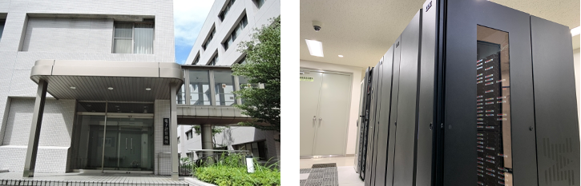

# 遺伝研スーパーコンピュータ(2025)


国立遺伝学研究所は生命・医学系研究における情報処理のための大規模計算基盤として、大規模クラスタ型計算機・大規模メモリ共有型計算機・大容量高速ディスク装置を備えた最新鋭のスーパーコンピュータシステムサービスを提供しています。





ディスク容量が逼迫しているためユーザーホームディレクトリ内のデータについて当研究所ではバックアップを取っておりません。利用者の責任においてバックアップを取っていただくようお願いいたします。


## 重要なお知らせ {#featured-news}


## 年度末アカウント継続申請について {#year-end-renewals}

例年通り年度末アカウント継続申請の受付を行っています。**6月30日を過ぎると、ホームディレクトを削除しますのでご注意願います。**


## 次期遺伝研スパコンへのリプレースのお知らせ {#next-gen-supercomputer}

2024年度末に次期遺伝研スーパーコンピュータシステムへのリプレースを行います。現在の遺伝研スパコンは2025年2月28日までの契約になっています。次期遺伝研スパコンは 2025年3月1日より稼働開始予定です。リプレースに伴い2月頃に遺伝研スパコンが利用できなくなる時期が1週間程度生じる見込みです。詳細は開札後の2024年10月ごろに掲載予定です。


## 2024 年度の定期メンテナンス等 {#2024-annual-maintenance}

2024 年度の定期メンテナンスは、2024 年 11 月ごろを予定しています。


## 2022 年 5 月 13 日(金) 個人ゲノム解析区画および一般解析区画大規模ユーザのアカウントの新規登録受付の一時停止 {#temporary-registration}

平素より、遺伝研スパコンをご利用いただき誠にありがとうございます。

現在、スパコンの計算リソースが CPU,ディスクとも非常に逼迫しているため、以下のユーザのアカウントの新規登録を一時停止させていただきます。

- 一般解析区画の大規模利用ユーザのアカウントの新規登録
- 個人ゲノム解析区画ユーザのアカウントの新規登録

以下の申請についてはこれまで通り受け付けます。

- 現在すでに一般解析区画の大規模利用ユーザである方々、 個人ゲノム解析区画のユーザである方々に付きましては、利用計画表の変更による利用リソースの追加はこれまで通り受け付けます。
- また、一般解析区画の通常のユーザー登録についてもこれまで通り受け付けます。その場合はディスクは初期設定の 1TB までの利用となります。
- 講習会などでの利用ついてもこれまで通り受け付けます。


その場合も、ご希望に添えない場合がありますのでご了承いただけますようお願いいたします。

アカウントの新規登録受付の再開時期につきましては、 計算リソースの空き状況を見ながら決めていくこととなります。４ヶ月ごとの空き状況の見通しを随時ホームページから公開しますので、利用を希望される方は空き状況の見通しを参考に、予め利用計画表を提出してください。ただし、空き状況は確定ではありませんのでご希望に添えない場合がありますのでご了承願います。


## 謝辞について {#acknowledgement}

遺伝研スーパーコンピュータシステムの活動は皆様の謝辞で評価されています。当スーパーコンピュータシステムを利用した論文が採択された際には以下の記載例を参考に謝辞への記載をお願いします。

記載例

```
==============================================

　　＜謝辞　英語＞
　　Computations were partially performed on the NIG supercomputer
　　at ROIS National Institute of Genetics.

==============================================

　　＜謝辞　日本語＞
　　本研究は、情報・システム研究機構 国立遺伝学研究所が
    有する遺伝研スーパーコンピュータシステムを利用しました。

================================================

```


